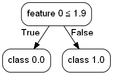
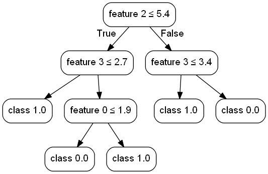
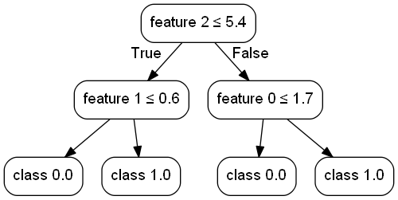

### Spark-Random-Forest-Parse
该工程可以线上部署spark-random-forest模型，并且实现了spark画图功能，分别基于python和scala实现。

1. 基于SparkMLTree，把随机森林中的决策树模型生成每一个json文件模型，如下所示，保存在resource下的json_model
文件夹下：
{
  "featureIndex":0,
  "gain":0.4591836734693877,
  "impurity":0.4591836734693877,
  "threshold":1.9,
  "nodeType":"internal",
  "impurityStats":[
    54.0,
    30.0
  ],
  "splitType":"continuous",
  "prediction":0.0,
  "leftChild":{
    "impurity":0.0,
    "nodeType":"leaf",
    "impurityStats":[
      54.0,
      0.0
    ],
    "prediction":0.0
  },
  "rightChild":{
    "impurity":0.0,
    "nodeType":"leaf",
    "impurityStats":[
      0.0,
      30.0
    ],
    "prediction":1.0
  }
}

2. com.strings.algo.tree.parse 文件下有两个文件，分别基于python和scala实现了解析Json模型文件形成树，功能基本一致，python版本的增加了画图功能，能把spark的树基于dot画出来。

第0棵树：

第5棵树：

第13棵树：

当然可以通过spark中RandomForestClassificationModel的toDebugString生成的树的结构对比，

Tree 0 (weight 1.0):
    If (feature 0 <= 1.9)
     Predict: 0.0
    Else (feature 0 > 1.9)
     Predict: 1.0

Tree 5 (weight 1.0):
    If (feature 2 <= 5.4)
     If (feature 3 <= 2.7)
      Predict: 1.0
     Else (feature 3 > 2.7)
      If (feature 0 <= 1.9)
       Predict: 0.0
      Else (feature 0 > 1.9)
       Predict: 1.0
    Else (feature 2 > 5.4)
     If (feature 3 <= 3.4)
      Predict: 1.0
     Else (feature 3 > 3.4)
      Predict: 0.0

  Tree 13 (weight 1.0):
    If (feature 2 <= 5.4)
     If (feature 1 <= 0.6)
      Predict: 0.0
     Else (feature 1 > 0.6)
      Predict: 1.0
    Else (feature 2 > 5.4)
     If (feature 0 <= 1.7)
      Predict: 0.0
     Else (feature 0 > 1.7)
      Predict: 1.0

3. 结果对比，基于Json模型解析的树，和原来spark存储的模型进行对比，发现结果完全一致。（这里的VectorIndex没有起作用）

